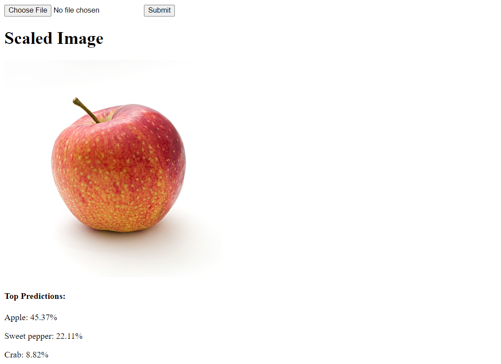
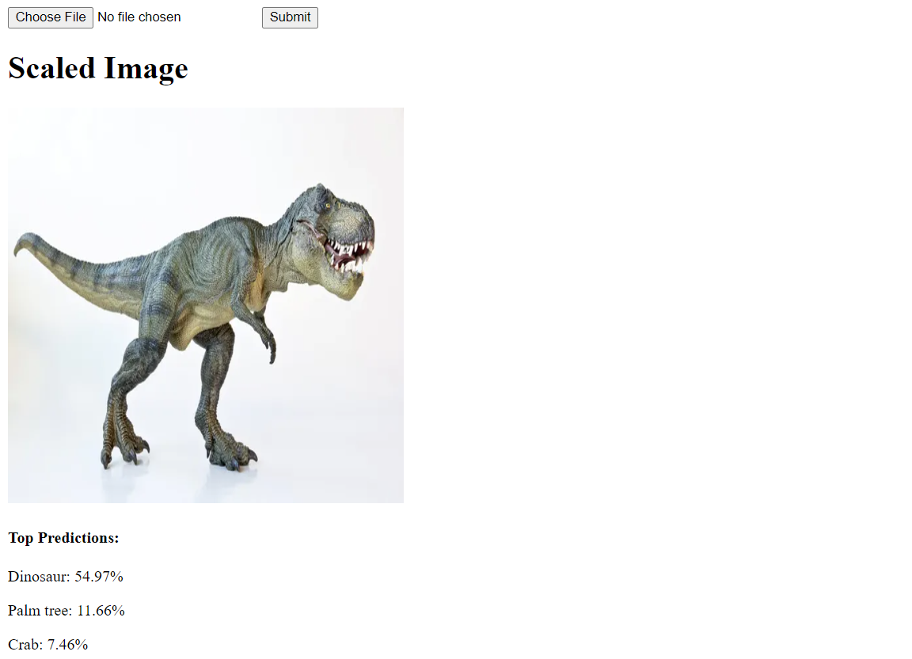

# CNN - CIFAR-100

CNN image classifier on the [CIFAR-100](https://www.cs.toronto.edu/~kriz/cifar.html) dataset.

## Description

The CIFAR-100 dataset contains images of 100 unique classes. There are 600 images (500 training, 100 testing) of each class.

| Superclass                     | Classes
| ------------------------------ | -----------------------------------------------------
| aquatic mammals                | beaver, dolphin, otter, seal, whale
| fish                           | aquarium fish, flatfish, ray, shark, trout
| flowers                        | orchids, poppies, roses, sunflowers, tulips
| food containers                | bottles, bowls, cans, cups, plates
| fruit and vegetables           | apples, mushrooms, oranges, pears, sweet peppers
| household electrical devices   | clock, computer keyboard, lamp, telephone, television
| household furniture            | bed, chair, couch, table, wardrobe
| insects                        | bee, beetle, butterfly, caterpillar, cockroach
| large carnivores               | bear, leopard, lion, tiger, wolf
| large man-made outdoor things  | bridge, castle, house, road, skyscraper
| large natural outdoor scenes   | cloud, forest, mountain, plain, sea
| large omnivores and herbivores | camel, cattle, chimpanzee, elephant, kangaroo
| medium-sized mammals           | fox, porcupine, possum, raccoon, skunk
| non-insect invertebrates       | crab, lobster, snail, spider, worm
| people                         | baby, boy, girl, man, woman
| reptiles                       | crocodile, dinosaur, lizard, snake, turtle
| small mammals                  | hamster, mouse, rabbit, shrew, squirrel
| trees                          | maple, oak, palm, pine, willow
| vehicles 1                     | bicycle, bus, motorcycle, pickup truck, train
| vehicles 2                     | lawn-mower, rocket, streetcar, tank, tractor

## Getting Started

### Dependencies

* Python 3.5+

### Installation

1. Clone repository
```
git clone https://github.com/j584lee98/CNN-CIFAR100
cd CNN-CIFAR100/
```

2. Install libraries
```
pip install -r requirements.txt
```

### Execution

```
python app.py
```

### Examples



